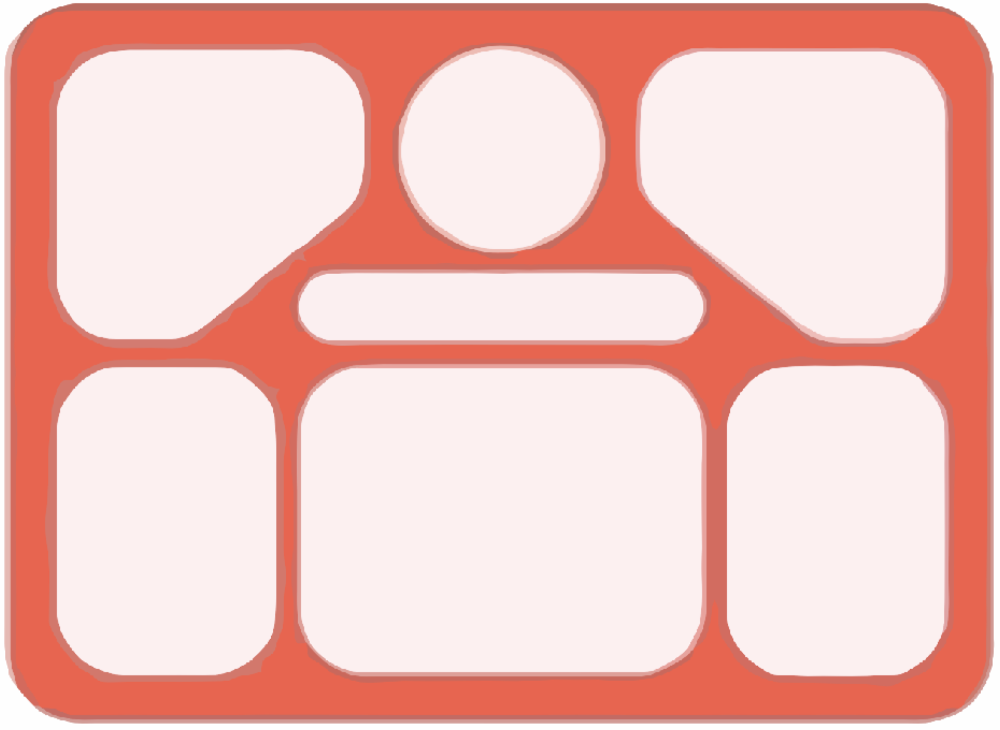

  
  <h1>Botejao - Bot for UNICAMP's Bandejão</h1>
   
   
  

# Botejao - Bot for UNICAMP's Bandejão 
> Wake up knowing what's on the menu everyday.

A telegram bot which sends UNICAMP's restaurant menu to a Telegram group.

The menu is sent in reverse order as to keep the menu of the current day in the bottom of the chat.

